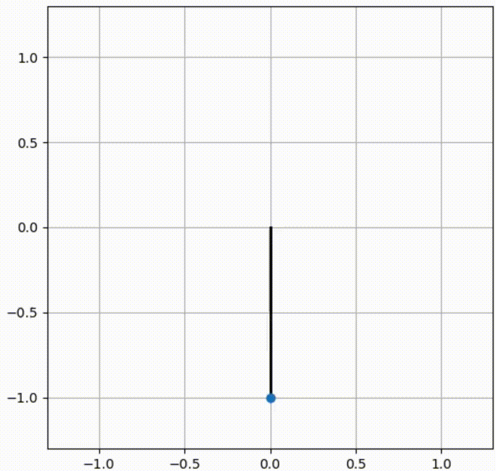
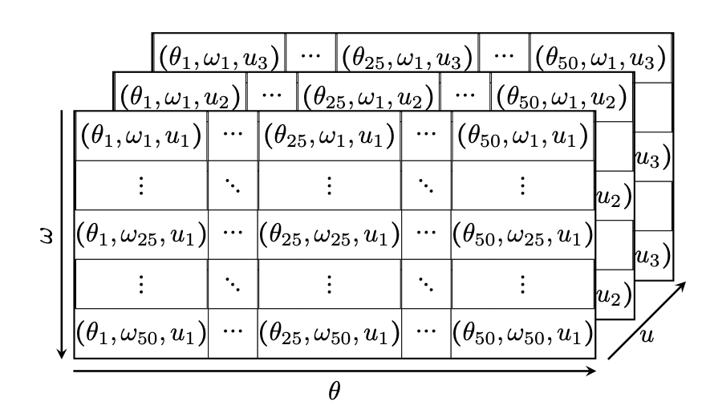
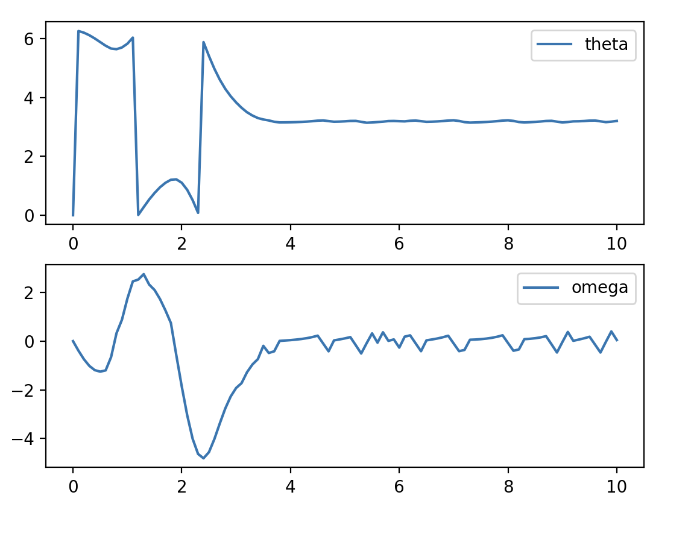
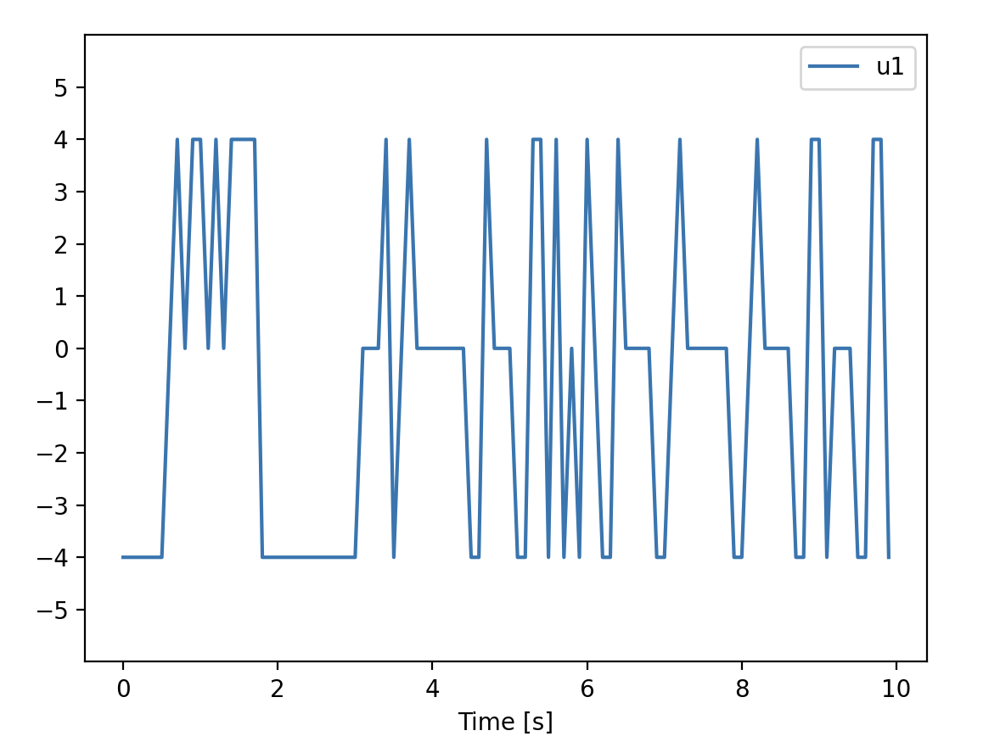
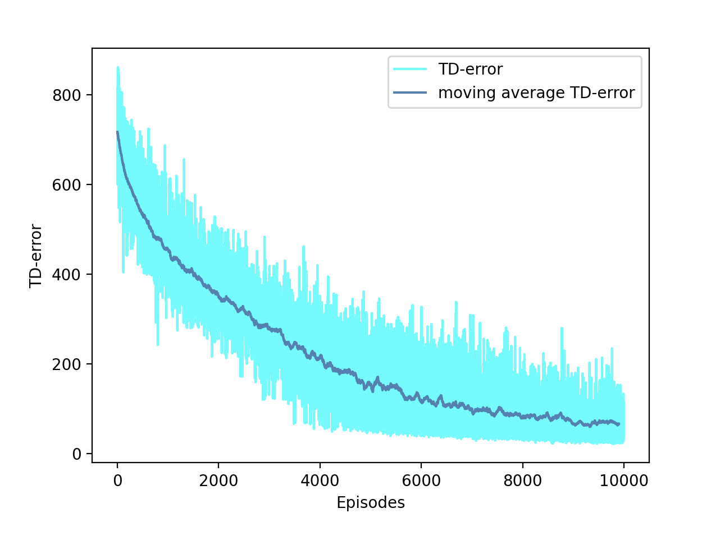
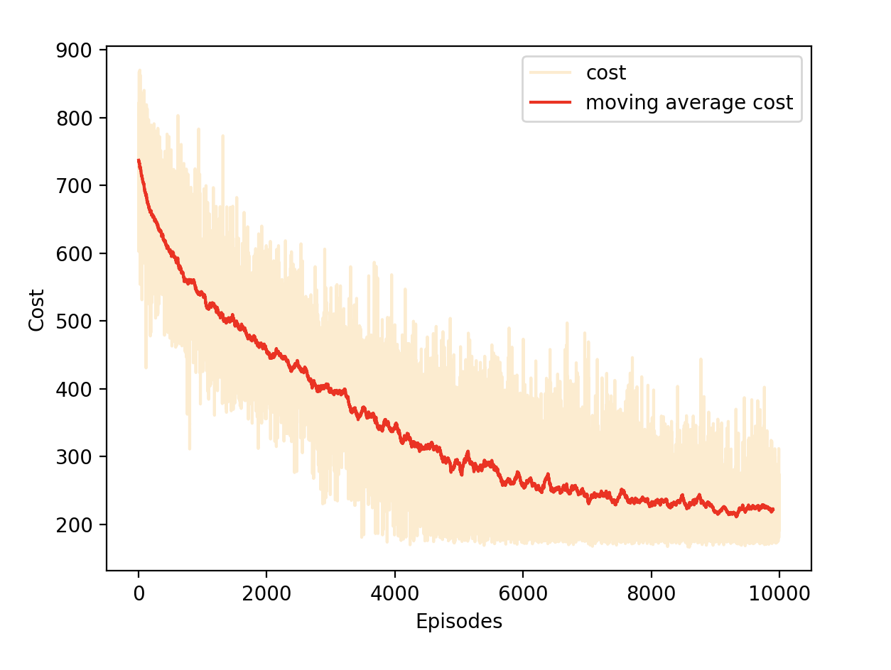
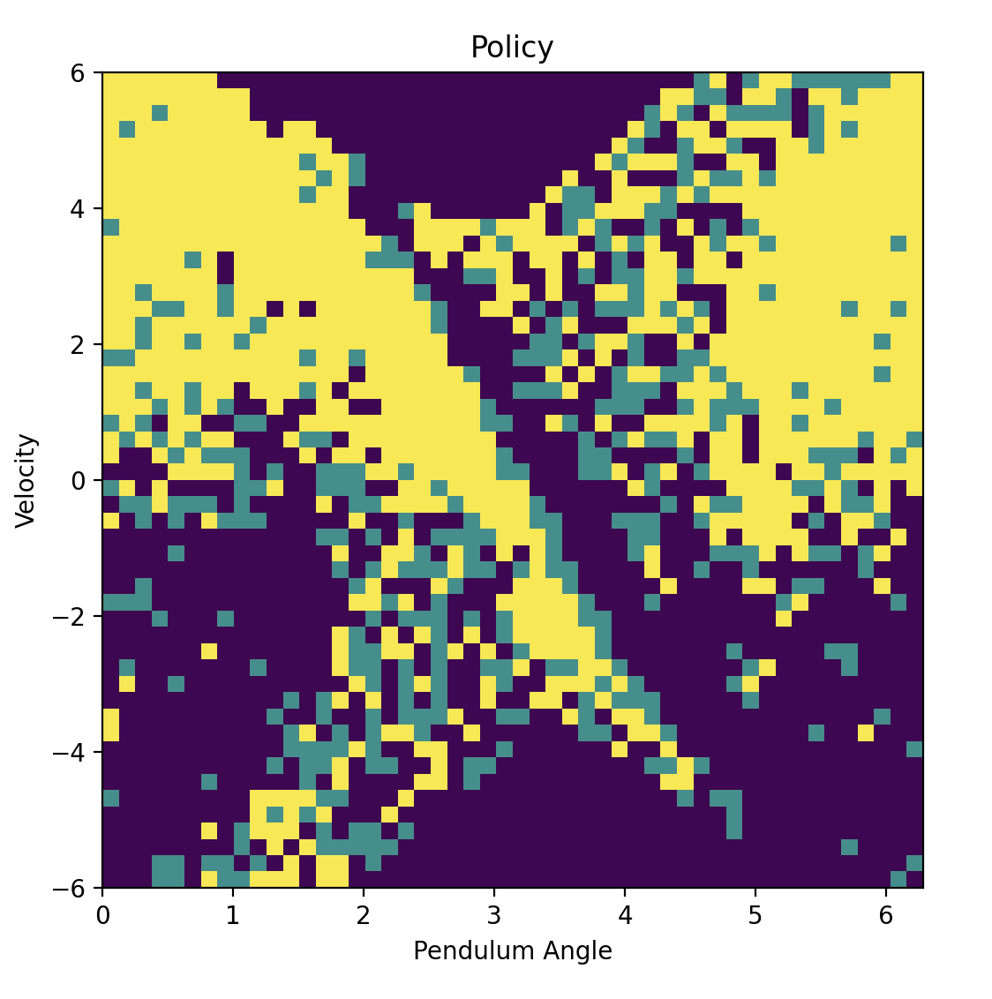
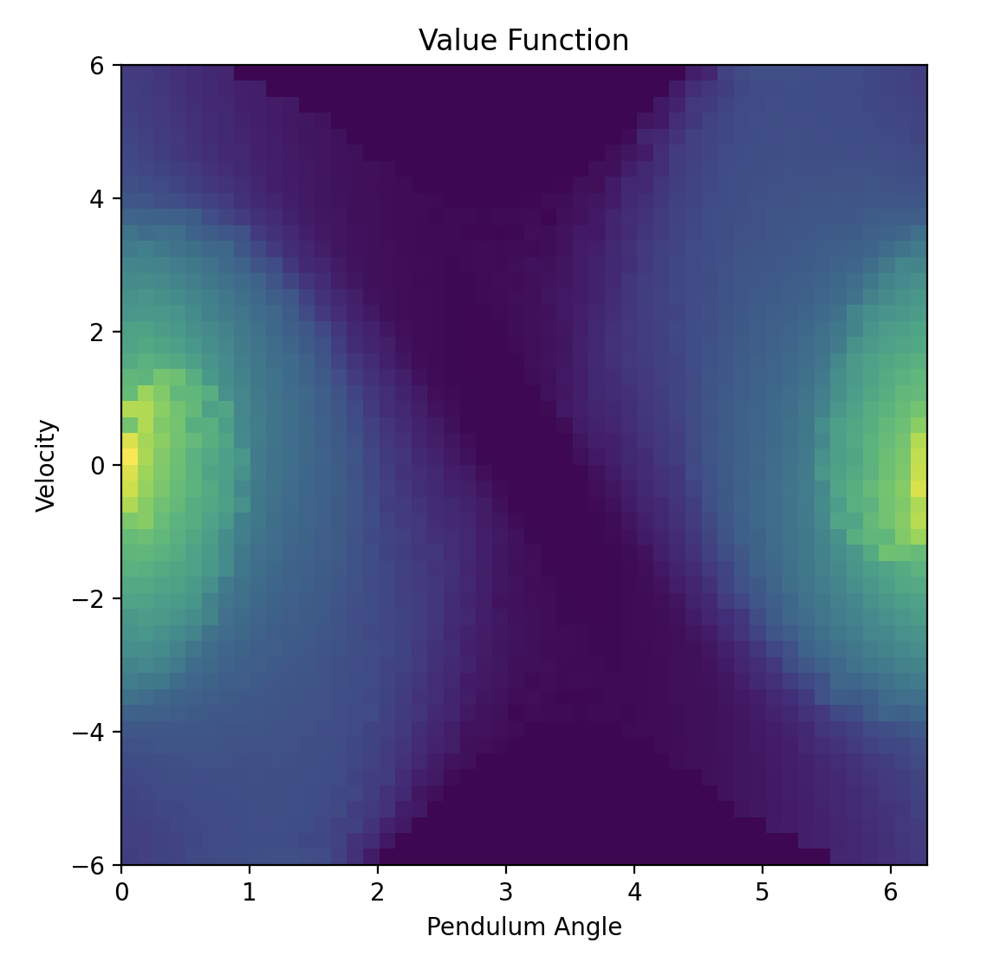

# Inverting the Pendulum: A Q-learning Adventure
Developed model-free controller using Q-learning to solve the inverted pendulum problem.

Simulation of simple pendulum

  
  

 

## Q-table

The Q-learning algorithm is implemented with a table, the dimension of the Q-table will be of dimension $\mathbf{50x50x3}$ to accomodate this $\mathbf{50}$ discretized states for $\theta$ and $\mathbf{50}$ for $\omega$. $u$ is limited to $3$ values for simplicity.

   

<em>Q-table</em>
 

## Algorithm

## Results
The results in the form of graphs are visualized below.

  
  

The learning curves show the TD-error and instantaneous cost during the learning process.

  
   

The policy and value function learnt are vizualized to give a better of the learning process.

  
   

## Report
To read a detailed report, click [HERE](assets/Report.pdf)
